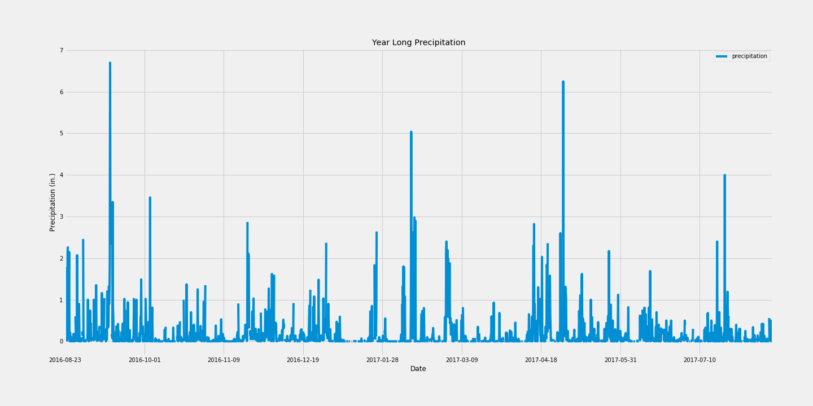

Climate Analysis on Honolulu Hawaii using Python and SQL Alchemy. 

By: Jared Adler

>See the deeper analysis for yourself in the Python Notebook titled "climate_starter.ipynb". 
>Note that all analysis was done using SQL Alachemy, Pandas DF, and Matplotlib

This first graph depicts the areas precipitation levels over a 12 month period and is summarized in the notebook using Pandas:

  

The second graph depicts the total observations at weather stations located in the area:

  

The third graph depics the average min, max, and average temperature in the area:

  
